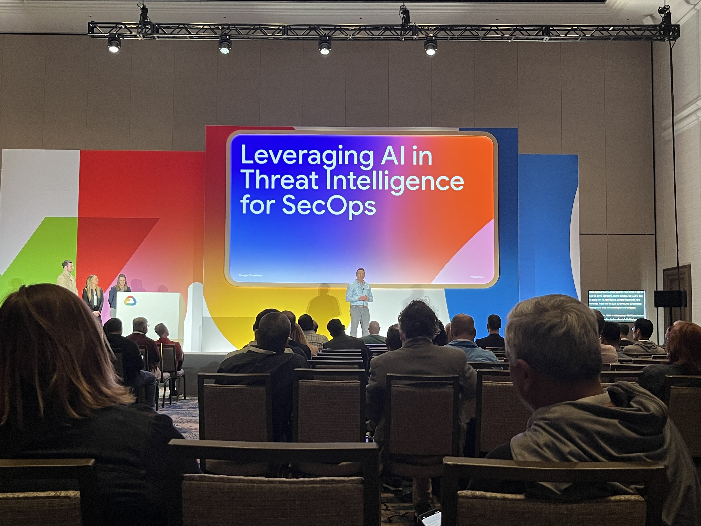
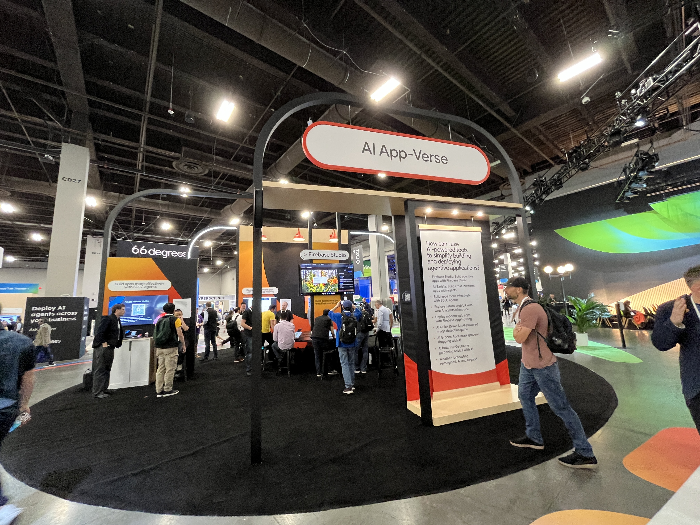
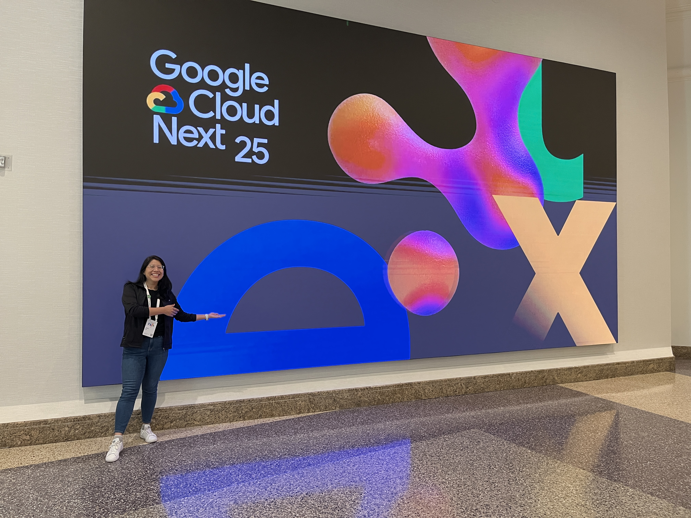

## Diving Deep into the Future of Cloud Security: My Top Takeaways from Google Cloud Next 2025
Google Cloud Next 2025 has just wrapped up, and my head is buzzing with exciting announcements, insightful sessions, and a renewed sense of the incredible innovation happening in cloud security. As a Cloud Security Engineer deeply invested in all things GCP security – from threat detection to cloud posture management and DevSecOps – I made it a priority to attend as many security-focused sessions as possible.

Even though I paid out of pocket (thankfully snagging a student discount for the $300 conference pass!), leveraging credit card points for the RT flight and a generous hotel transfer from a friend (costing me roughly $150 for 3 nights), I can confidently say that Google Cloud Next is an invaluable conference for any practitioner working within the Google Cloud Platform.

Beyond the excellent sessions, the expo floor was also a fantastic experience. Getting the chance to connect with Security SMEs from Google and explore various vendor demos provided a real-world perspective on the latest security tools and technologies. One demo that particularly stood out was GitHub's new Security Campaigns tool, which aims to help organizations fix security alerts at scale. You can find more information about this innovative feature here: [About GitHub Security Campaigns](https://docs.github.com/en/enterprise-cloud@latest/code-security/securing-your-organization/fixing-security-alerts-at-scale/about-security-campaigns). This tool seems like a significant step forward in enabling efficient remediation of security vulnerabilities within the development pipeline.

## Here are some of my key takeaways and reflections from the event, along with links to the sessions I found particularly valuable:

#### The Power of Security Command Center: Your Cloud Risk Management Hub

One of the central themes was undoubtedly the critical role of Security Command Center (SCC) as the go-to solution for managing cloud risks. The session "Find and eliminate cloud risks with Security Command Center" (https://youtu.be/uEqi96osNRc?si=-ZHKt6-hNXaKJEfm) highlighted how SCC proactively manages threats, security posture, data, and identities across your entire Google Cloud footprint. It's clear that understanding and leveraging SCC is fundamental for any organization serious about GCP security.

#### The Evolving AI Cyberthreat Landscape: A Look from the Trenches

The session "Unmasking the AI cyberthreats with tales from the trenches" (https://www.youtube.com/watch?v=nyDOyZGGs8A&t=1s) was a real eye-opener. Hearing from Google Cloud experts and security leaders about how cybercriminals are weaponizing generative AI to launch sophisticated attacks was both fascinating and concerning. The discussion around AI-fueled attacks and autonomous hacking tools underscored the urgent need for us, as security practitioners, to understand these threats deeply and adapt our defenses accordingly. The emphasis on learning from real-world experiences and the solutions offered by leading security ISVs provided valuable insights into fighting back against these advanced threats.

#### Reducing the Attack Surface: The Power of Advanced Identity Management (CIEM)

Two sessions focused on the critical aspect of identity management: "Reduce the attack surface of your cloud with advanced identity management" (https://www.youtube.com/watch?v=6esZV_aN9Rg&t=2s). These sessions drilled down into how SCC integrates Cloud Infrastructure Entitlement Management (CIEM). The ability to understand user access to cloud resources, leverage ML-generated recommendations to reduce unnecessary permissions, and accelerate responses to identity-driven vulnerabilities is crucial for minimizing the attack surface of any GCP environment. This reinforces the principle of least privilege as a cornerstone of cloud security.

#### Securing from Code to Cloud: Embracing Shift-Left Security

The session "Secure from code to cloud with Security Command Center" (https://www.youtube.com/watch?v=7keYMKlRYPU&t=1s) focused on the increasingly important practice of "shift-left" security. It's no longer enough to secure just the infrastructure; we need to ensure that cloud applications themselves are built securely from the outset. The session covered strategies for building secure applications, achieving code-to-cloud traceability of code-related issues, and leveraging AI-generated remediations to help development teams fix vulnerabilities at the source. This integration of security into the development lifecycle is essential for preventing vulnerabilities from ever reaching production.

*Snyk Integration with Security Command Center*: As part of the discussion around securing from code to cloud, it's worth noting the integration of tools like Snyk with Security Command Center. This integration allows for the seamless import of Snyk findings into SCC, providing a unified view of security risks across your entire application stack, from code to cloud. You can learn more about this integration in this article: [Snyk Integration with Google Security Command Center](https://snyk.io/blog/snyk-integration-google-security-command-center/).

#### Understanding Default Service Accounts

In the session "Exploring and securing Google Cloud default service accounts: Deep dive and real-world adoption trends", the speaker recommended checking out this article for a deeper understanding of the topic: Exploring Google Cloud Default Service Accounts: Deep Dive and Real-World Adoption Trends. This article provides a comprehensive look at the functionality, risks, and adoption trends associated with default service accounts in Google Cloud, a crucial aspect of GCP security.

#### Proactive Risk Discovery: Deploying a Virtual Red Team

The session "Deploying a virtual red team to find cloud risks you didn’t know about" (https://www.youtube.com/watch?v=TdGkKm5KGhY&t=1s) highlighted the power of proactive risk identification. The explanation of how SCC uses virtual red team technology and a new security graph to continuously analyze cloud resource configurations, software vulnerabilities, and identity and access policies at scale was impressive. This capability to pinpoint the issues that pose the most significant risk is invaluable in a complex GCP environment with potentially thousands of security findings.

## Key Takeaways and Reflections:

+ AI is a Double-Edged Sword: While AI offers immense potential for enhancing security, it's also being weaponized by attackers. We need to stay ahead of these threats by understanding their tactics and leveraging AI-powered defenses.
+ SCC is Your Central Security Hub: Security Command Center is evolving into an even more comprehensive platform for managing and mitigating cloud risks across various domains within GCP.
+ Identity is the New Perimeter: Robust identity and access management, with the help of CIEM, is crucial for reducing the attack surface of your GCP environment.
+ Shift-Left Security is Essential: Integrating security early in the development lifecycle is the most effective way to build secure cloud applications on GCP.
+ Proactive Risk Management is Key: Continuously analyzing your GCP environment to identify and prioritize the most critical risks is vital for effective security.
+ Integrated Security Tools: The integration of tools like Snyk with SCC provides a more holistic view of your security posture within the GCP ecosystem.
+ Default Service Accounts Require Scrutiny: Understanding the risks associated with default service accounts and implementing proper security measures is critical for securing your GCP environment.

Embracing the AI Revolution: It's clear that Artificial Intelligence is not something to fear but rather a technology that will become increasingly embedded in our technical workflows. For myself, as a security practitioner in GCP, AI represents a powerful tool that I will need to actively leverage and deeply understand to stay ahead of the evolving threat landscape.

For anyone working with Google Cloud Platform, especially in a security role, Google Cloud Next is an invaluable investment. The insights gained, the connections made, and the understanding of the future direction of the platform are well worth the effort and cost. I'm already looking forward to Next 2026!

*This blog post was drafted with a little proofreading help from Gemini 🤖.*